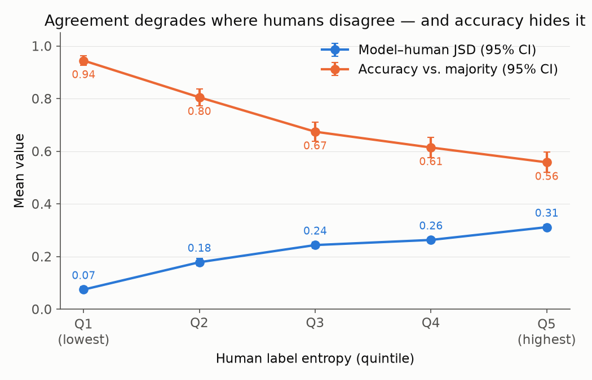

# DisagreeBench

**Model-Reported Uncertainty Finds Hard Items, Not Model Errors:
LLM Annotators Under Human Disagreement and the Economics of Routing**

📄 **[Paper (PDF)](paper/main.pdf)** ·
🌐 **[Project page](https://yogyam.github.io/DisagreeBench/)** ·
Yogya Mehrotra, 2026

## TL;DR

Ask an LLM the same contested question 10 times and it gives the identical
answer on 85–94% of items — even where 100 humans split 50/50. So
"route items the model is unsure about to humans" has no signal to route on.
But *ask* the model to estimate how 100 annotators would split, and its
estimate is ~3× closer to the real human label distribution and does carry
routing signal — worth ~1.5× your annotation budget against a weak fallback.
The catch: against the model's own best output, routing by its uncertainty is
**worse than random**, because the model's errors hide in items it is
confidently wrong about.

> **Model uncertainty tells you where the task is hard — never where the
> model is wrong.**



## Key results

| | ChaosNLI (NLI) | DICES-350 (safety) | LeWiDi-Par (post-cutoff labels) |
|---|---|---|---|
| Determinism across 10 samples | 0.85 | 0.94 | 0.90 |
| JSD to human dist — sampled | 0.224 | 0.225 | 0.224 |
| JSD to human dist — verbalized | **0.072** | **0.090** | **0.154** |
| Gate ρ (verbalized entropy vs human entropy) | 0.393 | 0.289 | 0.039† |
| Split-half noise ceiling | 0.843 | 0.750 | −0.002 |

† Unmeasurable, not failed: a 4-annotator panel's split-half entropy
correlation is zero, so no signal could register — routing gates are only
measurable against deep annotator panels.

Router simulation (budget sweep, regret oracles): verbalized-entropy routing
captures 37% (ChaosNLI) / 29% (DICES) of the achievable oracle gain against
sampled fallbacks — random allocation needs 1.25–1.57× the budget to match —
and **anti-selects (worse than random) against verbalized fallbacks** on both
datasets. One verbalized model call ≈ 5 human labels in distributional terms.

## Reproducing

Everything runs from saved elicitation outputs in `results/` — the router
and analyses need **no API access**. Re-eliciting from scratch costs ≈$30–36
total (claude-sonnet-5; every run was projected from a measured 50-item
pilot first).

```sh
python3 -m venv .venv
.venv/bin/pip install -r requirements.txt
# For re-elicitation only: put ANTHROPIC_API_KEY=... in a .env file
```

```sh
# ChaosNLI (download ChaosNLI v1.0 into data/raw/ first — not redistributed here)
.venv/bin/python scripts/prepare.py                     # entropy quintiles + pilot split
.venv/bin/python scripts/elicit.py submit --split examples   # sampled arm (10x, Batches API)
.venv/bin/python scripts/verbalize.py run --split examples   # verbalized arm (sync)
.venv/bin/python scripts/analyze.py --tag examples --split examples
.venv/bin/python scripts/router.py  --split examples --tag examples --base both

# Replications (DICES-350 is CC BY 4.0; LeWiDi-2025 data is public — see scripts for sources)
.venv/bin/python scripts/prepare_v3.py dices
.venv/bin/python scripts/elicit_v3.py sampled    --dataset dices350
.venv/bin/python scripts/elicit_v3.py verbalized --dataset dices350
.venv/bin/python scripts/router.py --split dices350 --tag dices350 --base both
.venv/bin/python scripts/prepare_v3.py par        # + elicit_v3 with --dataset par
```

Robustness variants: `router.py --metric tvd` and `--protocol bootstrap`.
Seeds: 20260805 (v0–v1), 20260819 (router), 20260912 (replications).

## Layout

```
paper/           LaTeX source, compiled PDF, arXiv submission tarball
docs/            project page (GitHub Pages)
scripts/         prepare(_v3), elicit(_v3), verbalize, analyze, router
results/         per-item model distributions, raw samples, router outputs
figures/         all paper figures
DRAFT.md         the paper in markdown (same content as the PDF)
```

`data/` is gitignored: ChaosNLI is not redistributed (regenerate via
`prepare.py`); DICES/LeWiDi download instructions are in `prepare_v3.py`.

## Relation to concurrent and prior work

The complete v2 router results were public in this repository from
**Aug 19, 2026** (see commit history). [Lail (2026)](https://arxiv.org/abs/2609.06444)
(posted Sept 6) independently ran an escalation-budget simulation on the same
ChaosNLI half-split and found the null form of the anti-selection result —
the two studies are complementary (details in §5.4 of the paper).
[Ni et al. (EACL 2026)](https://arxiv.org/abs/2506.19467) established
verbalized > sampled for disagreement prediction on other tasks; this work
replicates that on 100-way NLI distributions and adds the channel-independence
finding, the budget-sweep router with its fallback-channel reversal, and the
split-half noise-ceiling analysis.

## Citation

```bibtex
@misc{mehrotra2026disagreebench,
  title  = {Model-Reported Uncertainty Finds Hard Items, Not Model Errors:
            LLM Annotators Under Human Disagreement and the Economics of Routing},
  author = {Mehrotra, Yogya},
  year   = {2026},
  url    = {https://yogyam.github.io/DisagreeBench/}
}
```
